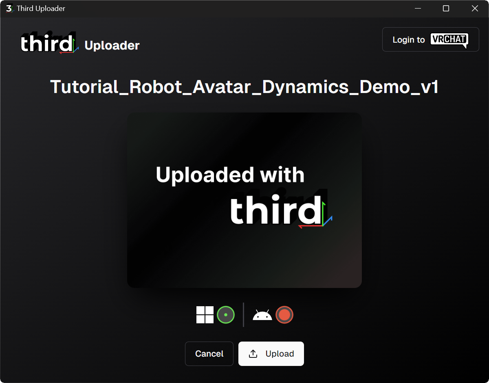

# Third Uploader

Upload pre-built avatars directly to VRChat.

Use it with [https://third3d.com/](https://third3d.com/) or build your own Third Avatar Bundle's (.3b) with [Third Unity SDK](https://github.com/third3d/unity-sdk)

## How to
1. Drag and drop a **Third Avatar Bundle** (.3b file) into the app
2. Press on **Upload**
3. Login to VRChat and wait for upload to finish